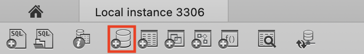
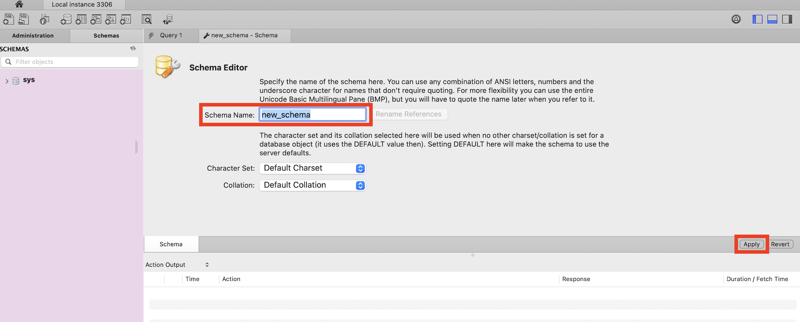

# **Task 1 - Creating a Schema**

## **Introduction**

Welcome to this tutorial on creating and dropping schemas in MySQL Workbench. In this guide, we will show you step-by-step how to create a new schema in MySQL Workbench.

Whether you are a beginner or an experienced user, this tutorial will provide you with the necessary skills to create schemas in MySQL Workbench. So, let's get started!

**_Note:_** _The examples that we create below are referenced in Task 2 – Creating Tables and Data Entry. Complete these examples if you want to follow the examples in Task 2._

### **Create a schema**

1. **Open** MySQLWorkbench by clicking on the MySQLWorkbench icon,
    which opens the “Home Window”. This window displays a section titled "MySQL Connections".
     
   One connection called “Local instance: 3306” should already exist.  
   &nbsp;  

- **Click** on the "Local Instance 3306" connection to connect to your local MySQL server.  
    
  Once you are connected you will see a screen with several tabs on top and in the toolbar on top you will see a Schema button which creates you a database.  
    
   &nbsp;  

- **Click** on the schema button.
   you will now be prompted to enter a name for your new schema.  
    
   &nbsp;  

- **Type** a name for your new schema. We named our schema "full_stack_web_development".  
  
  **_Note: _** Make sure to choose a name that is descriptive and easy to remember and do not change the character set and the collation setting.  
   &nbsp;  

- **Click** on the "Apply" button, after you have entered your schema name.  
  
  Once you click on the apply button you will get a pop-up message that shows you MySQL query which is the command related to the task you are doing manually.  
   &nbsp;  

- **Click** "Apply", then "Close".  

Congratulations! You have just created your first schema in MySQL Workbench. You can now begin adding tables to your new schema.

## **Conclusion**

Creating and dropping schemas is an essential skill in MySQL Workbench that every user must learn. By following the instructions in this tutorial, you should be able to create a new schema in MySQL Workbench, select a name for your schema, and drop the schema if necessary. Remember to choose a descriptive name for your schema and avoid changing the character set and the collation setting.
