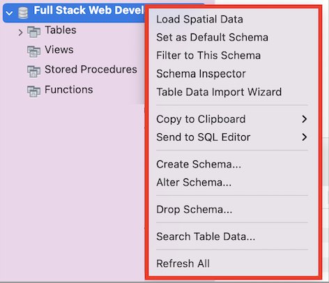

# **Task 4 - Dropping Schemas**

## **Introduction**

In a MySQL database, it may be necessary to drop a schema (database) for various reasons, such as restructuring or cleaning up the database. This task requires careful consideration and caution since dropping a schema will permanently delete all of its data. In this guide, we will walk you through the process of dropping a schema in MySQL Workbench.

## **Dropping a Schema**

1. **Right click** on the schema that you created, you will see a screen with several tabs.  
  
  &nbsp;  

* **Delete** your schema (database) by selecting the drop schema button from the list.  
  
  A pop-up notification asking for your confirmation to delete your schema should be expected.  
    &nbsp;  

* Click on “Drop Now”  
**_Warning:_** _Deleting a schema is irreversible._
  

Congratulations! You have just deleted your first schema.

## **Conclusion**

In this instruction set, we learned how to drop a schema in MySQL Workbench. The process involved right-clicking on the schema that needs to be deleted, selecting the drop schema option from the list, and clicking "Drop Now" after confirming the deletion in the pop-up notification. It is important to be cautious when dropping a schema since it will permanently delete all the tables and data within that schema.
